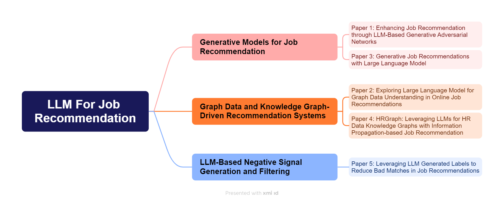

# LLM for Job Recommendation - Literature Survey

LLM和职位推荐（Job Recommendation）相关的论文

## Index
- [BSAELINE——Session-based Framework: BISTRO](#baseline-session-based-framework-bistro)
- [LLM for Job Recommendation](#llm-for-job-recommendation)
- [Job Recommendation Surveys](#job-recommendation-surveys)
- [Classification of papers](#classification-of-papers)

---
### BASELINE Session-based Framework: BISTRO
| # 	| 论文标题 	| 作者 	| 单位 	| 年份 	| 会议/期刊 	| 论文内容 	| 论文链接 	| 代码 	|
|:---:	|---	|:---:	|:---:	|:---:	|:---:	|:---:	|:---:	|:---:	|
| 1 	| Adapting Job Recommendations to User Preference Drift with Behavioral-Semantic Fusion Learning 	| Xiao Han et al. 	| City University of Hong Kong 	| 2024 	| KDD 	| [BISTRO](1_BISTRO.md) | [DOI](https://doi.org/10.1145/3637528.3671759) | [Github](https://github.com/Applied-Machine-Learning-Lab/BISTRO) |

---
### LLM for Job Recommendation
| # 	| 论文标题 	| 作者 	| 单位 	| 年份 	| 会议/期刊 	| 论文内容 	| 论文链接 	| 代码 	|
|:---:	|---	|:---:	|:---:	|:---:	|:---:	|:---:	|:---:	|:---:	|
| 2 	| Enhancing Job Recommendation through LLM-Based Generative Adversarial Networks 	| Yingpeng Du et al. 	| Nanyang Technological University 	| 2024 	| AAAI 	| [LGIR](2_LGIR.md) | [DOI](https://doi.org/10.1609/aaai.v38i8.28678) | - |
| 3 	| Exploring Large Language Model for Graph Data Understanding in Online Job Recommendations 	| Likang Wu et al. 	| University of Science and Technology of China 	| 2024 	| AAAI 	| [GLRec](3_GLRec.md) | [DOI](https://doi.org/10.1609/aaai.v38i8.28769) | [Github](https://github.com/WLiK/GLRec) |
| 4 	| Generative Job Recommendations with Large Language Model 	| Zhi Zheng et al. 	| Career Science Lab, BOSS Zhipin 	| 2023 	| Preprint 	| [GIRL](4_GIRL.md) | [arXiv](https://arxiv.org/abs/2307.02157) | - |
| 5 	| HRGraph: Leveraging LLMs for HR Data Knowledge Graphs with Information Propagation-based Job Recommendation 	| Azmine Toushik Wasi 	| Shahjalal University of Science and Technology 	| 2024 	| ACL Workshop KaLLM 	| [HRGraph](5_HRGraph.md) | [DOI](https://doi.org/10.48550/arXiv.2408.13521) | [Github](https://github.com/azminewasi/HRGraph) |
| 6 	| Leveraging LLM generated labels to reduce bad matches in job recommendations 	| Yingchi Pei et al. 	| Indeed 	| 2024 	| ACM RecSys 	| [eBadMatch](6_eBadMatch.md) | [DOI](https://doi.org/10.1145/3640457.3688043) | - |

---

### Job Recommendation Surveys
| # 	| 论文标题 	| 作者 	| 单位 	| 年份 	| 会议/期刊 	| 论文内容 	| 论文链接 	| 代码 	|
|:---:	|---	|:---:	|:---:	|:---:	|:---:	|:---:	|:---:	|:---:	|
| 7 	| A Survey of Recommendation Systems: Recommendation Models, Techniques, and Application Fields 	| Hyeyoung Ko et al. 	| Seoul Women’s University 	| 2022 	| Electronics 	| [Survey](7_Survey.md) | [DOI](https://doi.org/10.3390/electronics11010141) | - |
| 8 	| A survey on large language models for recommendation 	| Likang Wu et al. 	| University of Science and Technology of China 	| 2024 	| WWW 	| [Survey](8_Survey.md) | [DOI](https://doi.org/10.1007/s11280-024-01291-2) | - |
| 9 	| A Survey on Skill Identification From Online Job Ads 	| IMANE KHAOUJA et al. 	| ENSIAS, Mohammed V University 	| 2021 	| IEEE Access 	| [Survey](9_Survey.md) | [DOI](https://ieeexplore.ieee.org/document/9517309) | - |

---
### Classification of papers

- `代码`：若论文未开源代码，标记为`-`
